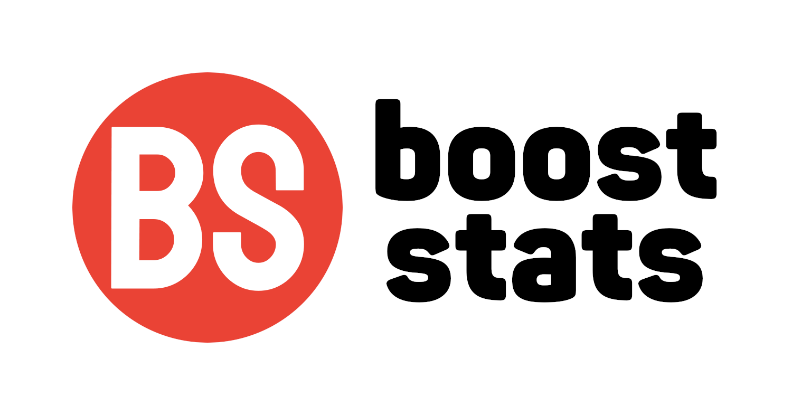

# BoostStats

BoostStats is a student progress dashboard built with Next.js 15, designed to display achievements, badges, and assignment statuses. Users can search, filter, and navigate through student data on a responsive interface.

## Table of Contents

1. [Features](#features)
2. [Getting Started](#getting-started)
3. [Usage](#usage)
4. [Technologies](#technologies)

---

## Features

- Search for students by name
- Pagination for easy navigation
- Display badges, progress, and assignment statuses
- Tabs for viewing completed and in-progress assignments
- Fully responsive design

---

## Getting Started

### Prerequisites

- Node.js (14.x or higher)
- npm or bun

### Installation

1. Clone the repository:

   ```bash
   git clone https://github.com/arkorty/BoostStats.git
   cd BoostStats
   ```

2. Install dependencies:

   ```bash
   npm install
   # or
   bun install
   ```

3. Start the development server:

   ```bash
   npm run dev
   # or
   bun run dev
   ```

4. Visit `http://localhost:3000` in your browser.

---

## Usage

- Search students by entering a name.
- Use pagination to move between pages.
- View assignment status and badges for each student.

---

## Technologies

- **Next.js 15**
- **TypeScript**
- **Tailwind CSS**
- **Lucide-React**

## License

This project is licensed under the MIT License. See the [LICENSE](LICENSE) file for details.
